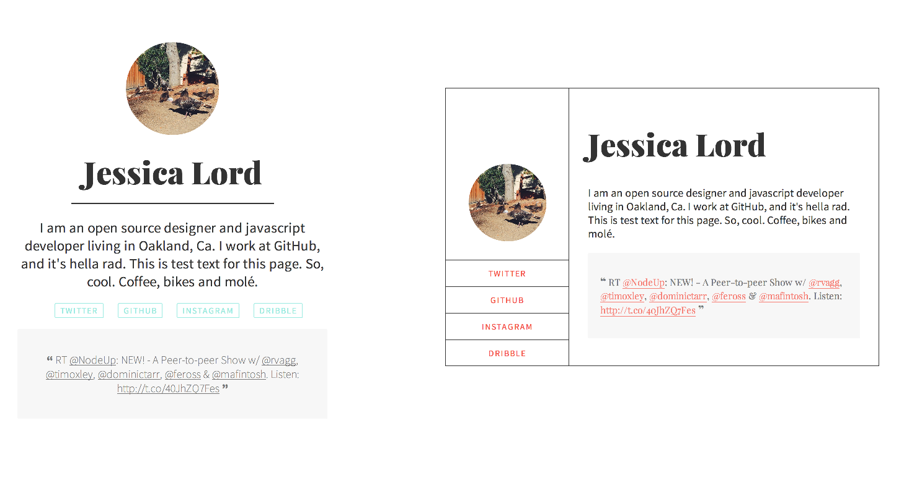

# Person Page

A simple personal site with your Twitter and Instagram, from a spreadsheets using [IFTTT](http://www.ifttt.com).

This is a [Fork-n-Go](http://www.jlord.github.io/forkngo) project, so fork to get started making your own.

See the demo at [jlord.github.io/person-page](http://jlord.github.io/person-page).

## Create your own

| You'll Need: |   |
| ------------ | - |
| [GitHub](http://www.github.com/signup) account | Basic [HTML](http://learn.shayhowe.com/html-css/) |

### First, fork this repository.

Click the fork button in the upper right. Now you have a copy of this repository on your GitHub account!

### Rename your fork

Once you've forked it, click on Settings and rename your fork, because probably `person-page` is not what you want in your URL. Name your new repository: `username.github.io` (but make `username` your username, for instance, I'd use `jlord.github.io`). GitHub will host all website files on the `master` branch of a repo with that account name convention. Woo! More info on that at [pages.github.com](http://www.pages.github.com).

You can also give it any 'ol name and GitHub will host it using this patter: `username.github.io/reponame`.

### Set up Twitter and Instagram with IFTTT

1. Go to [ifttt.com](https://www.ifttt.com) and create an account, use these recipes for creating a row on a spreadsheet every time you Instagram or Tweet.
 - Twitter [recipe](https://ifttt.com/recipes/178972-all-your-tweets-in-a-google-spreadsheet)
 - Instagram [recipe](https://ifttt.com/recipes/178973-copy-any-instagram-picture-i-take-to-google-drive)
2. Instagram or Tweet so that a spreadsheet is created. _It may take 10-15 mins for it to appear._
3. Go to those spreadsheets and add a header row.
 - For the Twitter one: **date, twitter, tweet, tweetURL**
 - For the Instagram one: **instadate, instacaption, instaurl, instasource**
4. Make each spreadsheet's data accessible:
 - File -> Publish to the Web -> Start Publishing
 - Share -> Anyone with link can view
5. Get each spreadsheet's URL, it's at the top of your browser!
6. In `index.hmtl` replace the URL's (`URL` and `URL2`) with the appropriate spreadsheet URL (or spreadsheet key, but make sure you get the entire key, including hyphens and underscores if you're using just the key.) You can edit `index.html` GitHub.com and the Edit button when you click on the filename from your fork's page, or in your favorite text editor.
7. Go through `index.html` and change links and names to your links and names!
7. Commit those changes and push them to GitHub (button at the bottom of the GitHub.com page your editing on, or through terminal or GitHub Desktop if you're using one of those).
8. BOOM! Go checkout your site at `username.github.io`

### Style

There are basic styles included in `style.css` but go wild and make it your own, try other things!

### Bonus Style

There is another style, on the `lines` branch. To access this style however you'll need to use your Terminal or GitHub desktop app to delete `gh-pages` and then rename `lines` to `gh-pages`.
